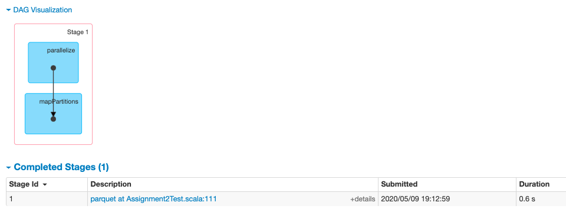
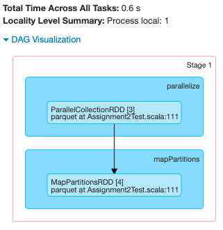

## Introduction

Driving is one of the most common yet dangerous tasks that people
perform every day. According to the NHTSA, there is an average of 6
million accidents in the U.S. per year, resulting in over 2.35 million
injuries and 37,000 deaths. [1] Additionally, road crashes cost the U.S.
$230.6 billion per year. There are various factors that can contribute
to accidents such as distracted driving, speeding, poor weather
conditions, and alcohol involvement. However, using these factors and
additional statistics, we can better predict the cause of accidents and
put laws and procedures in place to help minimize the number of
accidents. For this assignment we will use Apache Spark to analyze the
motor vehicle collisions in New York City (NYC). Our goal is to gain
additional insights into the causes of accidents in the Big Apple and
how we can help to prevent them.

## Datasets

The following datasets were used for our analysis, with the NYC Motor
Vehicle Collisions - Crashes being used for a majority of the analysis.
All of the datasets were obtained from NYC OpenData in CSV format and
contain the most up to date motor vehicle collision information
available to the public.

### NYC Motor Vehicle Collisions - Crashes: [2]

Contains information about the motor vehicle collisions in NYC from July
2012 to February 2020. The data was extracted from police reports (form
MV104-AN) that were filed at the time of the crash. A form MV104-AN is
only filed in the case where an individual is injured or fatally
injured, or when the damage caused by the accident is $1,000 or greater.
This dataset has 29 columns, 1.65 Million rows, and a size of 369 MB.
Each row includes details about a specific motor vehicle collision.

### NYC Motor Vehicle Crashes - Vehicle: [3]

Contains information about each vehicle that was involved in a crash in
NYC from September 2012 to May 2020 and a police report MV104-AN was
filed. This dataset has 3.35M rows, 25 columns, and a size of 566.3 MB.
Each row represents the vehicle information for a specific crash, which
can also be tied back to the NYC Motor Vehicle Collisions - Crashes
dataset. Multiple vehicles can be involved in a single crash.

### 2015 NYC Tree Census: [4]

Contains detailed information on the trees living throughout NYC
collected by the NYC parks and recreation board in 2015. This datset has
684K rows, 45 columns, and has a size of 220.4 MB. Each row represents
the information for a tree living in NYC.

## Chosen Spark API for Answering Analytical Questions

I chose to use the Spark DataFrames API for my analysis. The Spark
DataFrames API is similar to relational tables in SQL, however it also
provides a programmatic API allowing for more flexibility in query
expressiveness, query testing, and is extensible. Additionally, the
datasets that we will be using for our analysis are in a format that can
be easily worked with using DataFrames. For example our data is in a
tabular format with columns and rows, which is how data is represented
in DataFrames. Additionally, DataFrames inherits all of the properties
of RDDs such as read only, fault tolerance, caching, and lazy execution
but with the additional data storage optimizations, code generation,
query planner, and abstraction.

## Loading Datasets

In the beforeAll() function, all three CSV files are read in as as
DataFrames, then compressed to Parquet format and persisted to external
storage. A check is made to determine if the Parquet files exist on disk
before running a test. If the files already exist then they will be
reused for all subsequent tests otherwise they will be regenerated.
Through the use of Parquet, our data will be stored in a compressed
columnar format, which will allow for faster read and write performance
as compared to reading from CSV. The file size of the datasets when
converted to parquet are significantly smaller as compared to the
original CSV files. For example, the CSV file for the NYC Motor Vehicle
\- Crashes was 369 MB and was reduced to 75.7 MB when converted to
Parquet. Additionally, the output Parquet files for the The NYC Motor
Vehicle - Vehicles dataset were partitioned by ZIP_CODE. By doing this,
the data is physically laid out on the filesystem in an order that will
be the most efficient for performing our queries.

Some data preparation was needed before converting to Parquet which
include the following.
- For all DataFrames, the whitespace between columns names needed to be
  replaced with underscores to avoid the invalid character errors when
  converting to Parquet. E.g. from CRASH TIME to CRASH_TIME.
- The data types of several columns in the NYC Motor Vehicle - Crashes
  dataset needed to br casted from a string to an integer type because they
  will be used for numerical calculations in our query.

The below Directed acyclic graph (DAG) show the operations performed
when reading a parquet file. This operation is performed each time a
test is ran. Spark performs a parallelize operation followed by a
mapPartitions operation.




## Analytic Questions

### 1. What is the top five most frequent contributing factors for accidents in NYC?

For this test, we first filtered out rows with an unspecified
contributing factor. Next, we perform a groupBy
CONTRIBUTING_FACTOR_VEHICLE_1, then a count the number of occurrence of
each contributing factor. Finally, we order by count and get the top 5
contributing factors.

#### Spark Internal Analysis

There are three stages that occur for this problem. In stage 1 we read
the Parquet file from disk or memory if it is cached (as seen in the
previous section). The RDDs created in stage 1 are
parrallelCollectionRDD followed by a mapPartitionsRDD. Next, in stage 2
a FileScanRDD is created, followed by a MapPartitionRDD, then another
MapParitionsRDD. In stage 3 a shuffledRowRDD is performed because we are
performing a group by which is a wide transformation, and thus data is
shuffled across the cluster of nodes. Next, a MapPartsRDD is created,
then another mapPartitionsRDD is created in the map step. Map is a
narrow transformation, so the computations do not need to be shuffled
across the cluster.


### 2. What percentage of accidents had alcohol as a contributing factor?

For this test, we first got the count of total accidents and stored in a
val numTotalAccidents. Next, we filtered out accidents where alcohol
involvement was a contributing factor for any of the vehicles involved
in the accident ans stored the result in numAlcoholRelatedAccidents.
Finally, we performed the following calculation to get the percentage.

```(numAlcoholRelatedAccidents * 100) / numTotalAccidents.toDouble ```

#### Spark Internal Analysis

The data in stage 2 was split into 27 partitions, each executing a task.
However, the data in stage 3 is only executing on a single partition.


### 3. What time of day sees the most cyclist injures or deaths caused by a motor vehicle collision?

For this test, we first filter out accidents where there was at least
one cyclist injury or fatality. Next, we perform a groupBy("CRASH_TIME")
and counted the number of crashes for the various times throughout a 24
hour period. Finally, we order by count in descending order and get the
top 3 times.

#### Spark Internal Analysis

As we can see from stage 2, the tasks each took various amount of time,
some longer and some shorter. Additionally, towards the end of each
task, a shuffle write was performed. This is due to a wide
transformation being performed, and thus the tasks will need to spend
some time writing the results across the cluster. In total stage 2 took
1.1 minute to complete all of its 27 tasks. On the other hand, stage 3
executed over 200 tasks with a total time across all tasks of only 13
seconds. By this we can tell that shuffling is costly when it comes to
execution time, especially if we are processing large amounts of data.


### 4. Which zip code had the largest number of nonfatal and fatal accidents?

Find the zip code with the largest number of nonfatal and fatal
accidents required several steps. First remove rows with null zip codes.
Next create a new column "TOTAL_INJURED_OR_KILLED", which is the sum of
all nonfatal and fatal injuries for each accident. Next, get the total
number of nonfatal and fatal injuries per zip code by first performing a
group by zip code. then use the agg and sum functions to sum up the
values in the TOTAL_INJURED_OR_KILLED column per zip code. Afterwards,
store the computed output per zip code in a column aliased as
TOTAL_INJURIES_AND_FATALITIES. Finally, order the results by
TOTAL_INJURIES_AND_FATALITIES in descending order and get the top 3.

#### Spark Internal Analysis

Since we are calling the filter function right after loading the
dataset, Spark will perform a predicate pushdown, where it will push the
filter down to the data source and perform the filter query before
returning the result. This improves query performance as it is having
the data source do the work before returning the result.


### 5. Which vehicle make, model, and year was involved in the most accidents?

In order to determine which vehicle make, model, and year was involved
in the most accidents, we first remove any rows where the vehicle make,
model, and year is null. Next, we did a groupBy("VEHICLE_MAKE",
"VEHICLE_MODEL", "VEHICLE_YEAR") then count and sort by descending order
and get the first value, which is the most accidents. Likewise, to get
the least accidents, we did the same previous steps but sort by
ascending order and got the first value.

#### Spark Internal Analysis

Simillar to test 4, test 5 is also performing a filter as it's first
function in the test, so Spark will also perform a predicate pushdown as
well.


Analysis


### 6. How do the number of collisions in an area of NYC correlate to the number of trees in the area?

The NYC motor vehicle collisions - crashes and 2015 NYC tree census
datasets were used for this test. We first rename the postcode column to
ZIP_CODE on the treeCensus DataFrame. Next, we perform a groupBy on the
treeCensus DataFrame to get the number of trees per zip code. We also,
performed a groupBy on the collisions DataFrame to get the number of
accidents per zip code. Finally, we did an inner equi-join of the
collisions DataFrame with the treeCensus DataFrame using the "ZIP_CODE"
collumn. Then finally, ordered by "TOTAL_CRASHES" in descending order.

#### Spark Internal Analysis

There were only two parquet jobs for the other tests. However, this test
uses two DataFrames instead of one, and thus required another job to
read the additional data. Additionally, since a join is a wide
transformation, shuffling needed to be performed. The code was ran on a
single executor with 4 RDD Blocks, 4 cores CPU, and 1.1 GB RAM.


## Project Overview

- Language: [Scala](https://www.scala-lang.org/)
- Framework: [Apache Spark](https://spark.apache.org/)
- Build tool: [SBT](https://www.scala-sbt.org/)
- Testing Framework: [Scalatest](http://www.scalatest.org/)

## Running Tests

### From Intellij

Right click on `ExampleDriverTest` and choose `Run 'ExampleDriverTest'`

### From the command line

On Unix systems, test can be run:

```shell script
$ ./sbt test
```

or on Windows systems:

```shell script
C:\> ./sbt.bat test
```

## Configuring Logging

Spark uses log4j 1.2 for logging. Logging levels can be configured in
the file `src/test/resources/log4j.properties`

Spark logging can be verbose, for example, it will tell you when each
task starts and finishes as well as resource cleanup messages. This
isn't always useful or desired during regular development. To reduce the
verbosity of logs, change the line `log4j.logger.org.apache.spark=INFO`
to `log4j.logger.org.apache.spark=WARN`

## Scala Worksheets

The worksheet `src/test/scala/com/spark/example/playground.sc` is a good
place to try out Scala code. Add your code to the left pane of the
worksheet, click the 'play' button, and the result will display in the
right pane.

Note: The worksheet will not work for Spark code.

## Documentation

* RDD: https://spark.apache.org/docs/latest/rdd-programming-guide.html
* Batch Structured APIs:
  https://spark.apache.org/docs/latest/sql-programming-guide.html

## References

[1] National Highway Traffic Safety Administration. “NCSA Publications
&amp; Data Requests.” Early Estimate of Motor Vehicle Traffic Fatalities
for the First Quarter of 2019, 2019,
https://crashstats.nhtsa.dot.gov/Api/Public/ViewPublication/812783.

[2] (NYPD), Police Department. “Motor Vehicle Collisions - Crashes: NYC
Open Data.” Motor Vehicle Collisions - Crashes | NYC Open Data, 8 May
2020,
data.cityofnewyork.us/Public-Safety/Motor-Vehicle-Collisions-Crashes/h9gi-nx95.

[3] (NYPD), Police Department. “Motor Vehicle Collisions - Vehicles: NYC
Open Data.” Motor Vehicle Collisions - Vehicles | NYC Open Data, 8 May
2020,
data.cityofnewyork.us/Public-Safety/Motor-Vehicle-Collisions-Vehicles/bm4k-52h4.

[4] Department of Parks and Recreation. “2015 Street Tree Census - Tree
Data: NYC Open Data.” 2015 Street Tree Census - Tree Data | NYC Open
Data, 4 Oct. 2017,
data.cityofnewyork.us/Environment/2015-Street-Tree-Census-Tree-Data/uvpi-gqnh.
